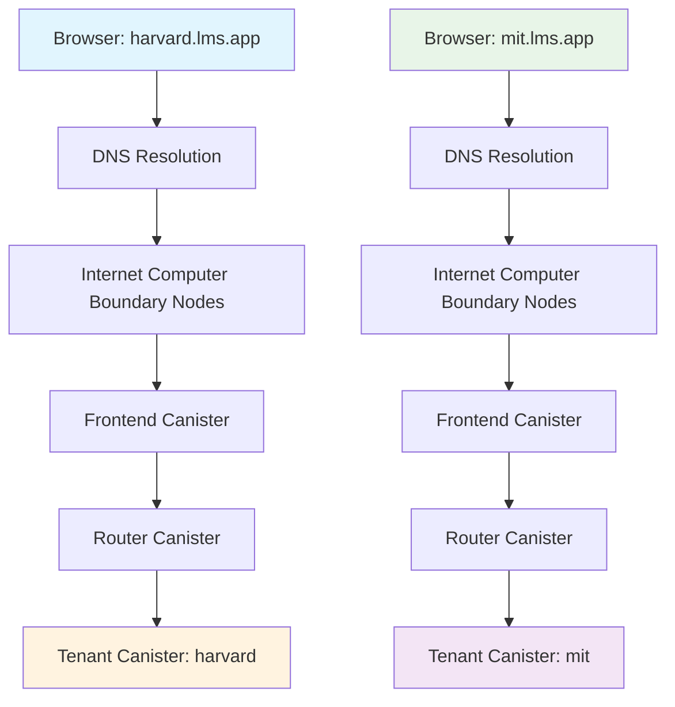
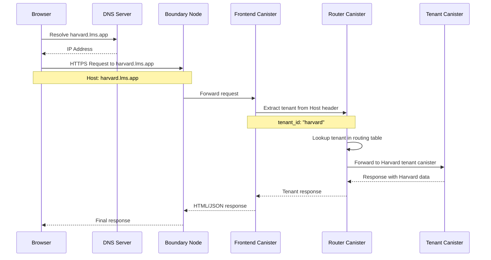

# Deployment Guide - DNS Configuration and Subdomain Routing

## Overview

This document outlines the DNS configuration and subdomain routing architecture required for deploying the Decentralized LMS in production. The system uses tenant-specific subdomains to route users to their respective educational institutions.

## Architecture Overview



## DNS Configuration

### 1. Wildcard CNAME Record Setup

Configure your DNS provider with the following records:

```dns
# Primary domain
lms.app.           300   IN   A      198.51.100.1
lms.app.           300   IN   AAAA   2001:db8::1

# Wildcard subdomain for all tenants
*.lms.app.         300   IN   CNAME  lms.app.

# Alternative: Direct to IC boundary nodes
*.lms.app.         300   IN   CNAME  ic0.app.
```

### 2. Internet Computer Custom Domain Setup

For production deployment on the Internet Computer:

```bash
# Add custom domain to your frontend canister
dfx canister call --network ic frontend configure_domain '("lms.app")'

# Configure wildcard subdomain routing
dfx canister call --network ic frontend configure_wildcard '("*.lms.app")'
```

### 3. DNS Record Examples

| Record Type | Name | Value | TTL |
|-------------|------|--------|-----|
| A | lms.app | 198.51.100.1 | 300 |
| AAAA | lms.app | 2001:db8::1 | 300 |
| CNAME | *.lms.app | lms.app | 300 |
| TXT | _canister-id.lms.app | "rdmx6-jaaaa-aaaah-qcaiq-cai" | 300 |

## Frontend Implementation

### 1. Hostname Extraction

The frontend extracts the subdomain from the browser's location and passes it to the backend:

```typescript
// utils/tenant.ts
export function extractTenantFromHostname(): string | null {
  const hostname = window.location.hostname;
  
  // Extract subdomain from hostname
  const parts = hostname.split('.');
  
  // Handle different scenarios
  if (parts.length >= 3) {
    // harvard.lms.app -> "harvard"
    const subdomain = parts[0];
    
    // Filter out common subdomains
    if (['www', 'api', 'admin'].includes(subdomain)) {
      return null;
    }
    
    return subdomain;
  }
  
  // Handle localhost development
  if (hostname.includes('localhost') || hostname.includes('127.0.0.1')) {
    // Extract from query parameter for development
    const urlParams = new URLSearchParams(window.location.search);
    return urlParams.get('tenant');
  }
  
  return null;
}

// services/api.ts
import { extractTenantFromHostname } from '../utils/tenant';

export class ApiService {
  private tenantId: string | null;
  
  constructor() {
    this.tenantId = extractTenantFromHostname();
  }
  
  async makeRequest(endpoint: string, options: RequestOptions = {}) {
    const headers = {
      'Content-Type': 'application/json',
      'X-Tenant-ID': this.tenantId || '',
      'X-Requested-With': 'XMLHttpRequest',
      ...options.headers
    };
    
    return fetch(`/api${endpoint}`, {
      ...options,
      headers
    });
  }
}
```

### 2. React Component Integration

```tsx
// components/TenantProvider.tsx
import React, { createContext, useContext, useEffect, useState } from 'react';
import { extractTenantFromHostname } from '../utils/tenant';

interface TenantContext {
  tenantId: string | null;
  tenantInfo: TenantInfo | null;
  loading: boolean;
  error: string | null;
}

const TenantContext = createContext<TenantContext | undefined>(undefined);

export function TenantProvider({ children }: { children: React.ReactNode }) {
  const [tenantId, setTenantId] = useState<string | null>(null);
  const [tenantInfo, setTenantInfo] = useState<TenantInfo | null>(null);
  const [loading, setLoading] = useState(true);
  const [error, setError] = useState<string | null>(null);
  
  useEffect(() => {
    const extractedTenantId = extractTenantFromHostname();
    setTenantId(extractedTenantId);
    
    if (extractedTenantId) {
      fetchTenantInfo(extractedTenantId);
    } else {
      setLoading(false);
      setError('No tenant found for this domain');
    }
  }, []);
  
  const fetchTenantInfo = async (tenantId: string) => {
    try {
      const response = await fetch(`/api/tenant/${tenantId}`);
      
      if (response.ok) {
        const info = await response.json();
        setTenantInfo(info);
      } else if (response.status === 404) {
        setError('Tenant not found');
      } else {
        setError('Failed to load tenant information');
      }
    } catch (err) {
      setError('Network error occurred');
    } finally {
      setLoading(false);
    }
  };
  
  return (
    <TenantContext.Provider value={{ tenantId, tenantInfo, loading, error }}>
      {children}
    </TenantContext.Provider>
  );
}

export const useTenant = () => {
  const context = useContext(TenantContext);
  if (!context) {
    throw new Error('useTenant must be used within TenantProvider');
  }
  return context;
};
```

## Backend Router Implementation

### 1. HTTP Header Processing

```rust
// src/router_canister/src/lib.rs
use ic_cdk::api::management_canister::http_request::{
    HttpHeader, HttpRequest, HttpResponse
};

#[query]
fn http_request(request: HttpRequest) -> HttpResponse {
    let tenant_id = extract_tenant_from_request(&request);
    
    match tenant_id {
        Some(tid) => route_to_tenant(tid, request),
        None => handle_no_tenant_error()
    }
}

fn extract_tenant_from_request(request: &HttpRequest) -> Option<String> {
    // Method 1: Extract from Host header
    if let Some(host_header) = find_header(&request.headers, "host") {
        if let Some(tenant) = extract_tenant_from_host(&host_header) {
            return Some(tenant);
        }
    }
    
    // Method 2: Extract from X-Tenant-ID header
    if let Some(tenant_header) = find_header(&request.headers, "x-tenant-id") {
        if !tenant_header.is_empty() {
            return Some(tenant_header);
        }
    }
    
    // Method 3: Extract from URL path
    extract_tenant_from_path(&request.url)
}

fn extract_tenant_from_host(host: &str) -> Option<String> {
    let parts: Vec<&str> = host.split('.').collect();
    
    if parts.len() >= 3 {
        let subdomain = parts[0];
        
        // Validate tenant name format
        if is_valid_tenant_name(subdomain) {
            return Some(subdomain.to_string());
        }
    }
    
    None
}

fn is_valid_tenant_name(name: &str) -> bool {
    // Tenant names must be alphanumeric with hyphens
    name.chars().all(|c| c.is_alphanumeric() || c == '-') &&
    name.len() >= 2 &&
    name.len() <= 50 &&
    !name.starts_with('-') &&
    !name.ends_with('-')
}

fn find_header(headers: &[HttpHeader], name: &str) -> Option<String> {
    headers.iter()
        .find(|h| h.name.to_lowercase() == name.to_lowercase())
        .map(|h| h.value.clone())
}
```

### 2. Tenant Routing Logic

```rust
// src/router_canister/src/routing.rs
use ic_cdk::call;

#[derive(Clone, Debug)]
pub struct TenantRoute {
    pub tenant_id: String,
    pub canister_id: Principal,
    pub status: TenantStatus,
}

#[derive(Clone, Debug)]
pub enum TenantStatus {
    Active,
    Suspended,
    Maintenance,
}

async fn route_to_tenant(tenant_id: String, request: HttpRequest) -> HttpResponse {
    // Look up tenant in routing table
    match get_tenant_route(&tenant_id).await {
        Ok(route) => {
            match route.status {
                TenantStatus::Active => {
                    // Forward request to tenant canister
                    forward_request(route.canister_id, request).await
                }
                TenantStatus::Suspended => {
                    create_error_response(503, "Tenant suspended")
                }
                TenantStatus::Maintenance => {
                    create_error_response(503, "Tenant under maintenance")
                }
            }
        }
        Err(LMSError::NotFound(_)) => {
            create_error_response(404, "Tenant not found")
        }
        Err(_) => {
            create_error_response(500, "Internal server error")
        }
    }
}

async fn forward_request(canister_id: Principal, request: HttpRequest) -> HttpResponse {
    match call(canister_id, "http_request", (request,)).await {
        Ok((response,)): Result<(HttpResponse,), _> => response,
        Err(_) => create_error_response(502, "Tenant service unavailable")
    }
}

fn create_error_response(status_code: u16, message: &str) -> HttpResponse {
    let body = format!(r#"{{
        "error": "{}",
        "status": {},
        "timestamp": "{}"
    }}"#, message, status_code, ic_cdk::api::time());
    
    HttpResponse {
        status_code,
        headers: vec![
            HttpHeader {
                name: "Content-Type".to_string(),
                value: "application/json".to_string(),
            },
            HttpHeader {
                name: "Access-Control-Allow-Origin".to_string(),
                value: "*".to_string(),
            }
        ],
        body: body.into_bytes(),
    }
}
```

## Request Flow Diagram



## HTTP Headers Involved

### Request Headers

| Header | Example | Purpose |
|--------|---------|---------|
| Host | `harvard.lms.app` | Primary tenant identification |
| X-Tenant-ID | `harvard` | Backup tenant identification |
| X-Requested-With | `XMLHttpRequest` | AJAX request identification |
| Origin | `https://harvard.lms.app` | CORS validation |
| Referer | `https://harvard.lms.app/dashboard` | Request source |

### Response Headers

| Header | Example | Purpose |
|--------|---------|---------|
| X-Tenant-ID | `harvard` | Confirm tenant routing |
| X-Canister-ID | `rdmx6-jaaaa-aaaah-qcaiq-cai` | Debug information |
| Access-Control-Allow-Origin | `*` | CORS support |
| Content-Type | `application/json` | Response format |

## Error Handling

### 1. Unknown Subdomain

When a subdomain is not found in the routing table:

```json
{
  "error": "Tenant not found",
  "status": 404,
  "tenant_id": "unknown-subdomain",
  "suggested_action": "contact_admin",
  "timestamp": "2025-01-15T10:30:00Z"
}
```

Frontend handling:
```typescript
// components/TenantErrorHandler.tsx
export function TenantErrorHandler({ error }: { error: string }) {
  if (error === 'Tenant not found') {
    return (
      <div className="error-container">
        <h1>Institution Not Found</h1>
        <p>The educational institution for this domain is not configured.</p>
        <button onClick={() => window.location.href = 'https://lms.app'}>
          Go to Main Site
        </button>
      </div>
    );
  }
  
  return <GenericErrorPage error={error} />;
}
```

### 2. Tenant Suspended

```json
{
  "error": "Tenant suspended",
  "status": 503,
  "tenant_id": "suspended-institution",
  "contact_email": "admin@lms.app",
  "timestamp": "2025-01-15T10:30:00Z"
}
```

### 3. Service Unavailable

```json
{
  "error": "Tenant service unavailable",
  "status": 502,
  "tenant_id": "harvard",
  "retry_after": 300,
  "timestamp": "2025-01-15T10:30:00Z"
}
```

### 4. Fallback Behavior

```typescript
// utils/fallback.ts
export class TenantFallbackHandler {
  static handleError(error: TenantError): void {
    switch (error.status) {
      case 404:
        // Redirect to tenant registration
        window.location.href = `https://lms.app/register?domain=${window.location.hostname}`;
        break;
        
      case 503:
        // Show maintenance page
        this.showMaintenancePage(error);
        break;
        
      case 502:
        // Retry with exponential backoff
        this.scheduleRetry(error.retry_after || 60);
        break;
        
      default:
        // Generic error page
        this.showGenericError(error);
    }
  }
  
  static scheduleRetry(delaySeconds: number): void {
    setTimeout(() => {
      window.location.reload();
    }, delaySeconds * 1000);
  }
}
```

## Development vs Production

### Development Setup

```javascript
// For local development
const TENANT_CONFIG = {
  development: {
    // Use query parameters for tenant routing
    extractTenant: () => new URLSearchParams(window.location.search).get('tenant'),
    baseUrl: 'http://localhost:8080'
  },
  production: {
    // Use subdomain extraction
    extractTenant: () => window.location.hostname.split('.')[0],
    baseUrl: 'https://lms.app'
  }
};
```

### Production Checklist

- [ ] DNS wildcard CNAME configured
- [ ] SSL certificates for `*.lms.app`
- [ ] Internet Computer custom domain setup
- [ ] Router canister deployed with tenant routing
- [ ] Frontend canister configured for subdomain handling
- [ ] Error pages for unknown tenants
- [ ] Monitoring for failed tenant lookups
- [ ] Rate limiting per tenant
- [ ] CORS configuration for subdomains

## Security Considerations

### 1. Subdomain Validation

```rust
fn validate_tenant_name(name: &str) -> Result<(), ValidationError> {
    // Length check
    if name.len() < 2 || name.len() > 50 {
        return Err(ValidationError::InvalidLength);
    }
    
    // Character validation
    if !name.chars().all(|c| c.is_alphanumeric() || c == '-') {
        return Err(ValidationError::InvalidCharacters);
    }
    
    // Reserved names
    const RESERVED: &[&str] = &["www", "api", "admin", "mail", "ftp"];
    if RESERVED.contains(&name) {
        return Err(ValidationError::ReservedName);
    }
    
    Ok(())
}
```

### 2. CORS Configuration

```rust
fn add_cors_headers(response: &mut HttpResponse, origin: Option<String>) {
    if let Some(origin) = origin {
        if is_allowed_origin(&origin) {
            response.headers.push(HttpHeader {
                name: "Access-Control-Allow-Origin".to_string(),
                value: origin,
            });
        }
    }
    
    response.headers.extend(vec![
        HttpHeader {
            name: "Access-Control-Allow-Methods".to_string(),
            value: "GET, POST, PUT, DELETE, OPTIONS".to_string(),
        },
        HttpHeader {
            name: "Access-Control-Allow-Headers".to_string(),
            value: "Content-Type, Authorization, X-Tenant-ID".to_string(),
        }
    ]);
}
```

## Monitoring and Debugging

### 1. Logging Configuration

```rust
#[derive(Debug)]
struct RequestLog {
    timestamp: u64,
    tenant_id: Option<String>,
    host_header: Option<String>,
    user_agent: Option<String>,
    ip_address: Option<String>,
    status_code: u16,
    response_time_ms: u64,
}

fn log_request(log: RequestLog) {
    ic_cdk::println!(
        "ROUTE: {} {} {} -> {} ({}ms)",
        log.tenant_id.unwrap_or("unknown".to_string()),
        log.host_header.unwrap_or("no-host".to_string()),
        log.ip_address.unwrap_or("unknown-ip".to_string()),
        log.status_code,
        log.response_time_ms
    );
}
```

### 2. Health Check Endpoints

```rust
#[query]
fn health_check() -> HealthStatus {
    HealthStatus {
        status: "healthy".to_string(),
        tenant_count: get_tenant_count(),
        uptime_seconds: ic_cdk::api::time() / 1_000_000_000,
        version: env!("CARGO_PKG_VERSION").to_string(),
    }
}
```

This documentation provides a comprehensive guide for setting up DNS configuration and subdomain routing for the Decentralized LMS in production environments.
